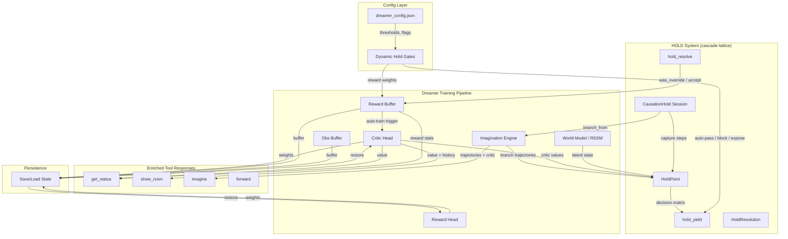
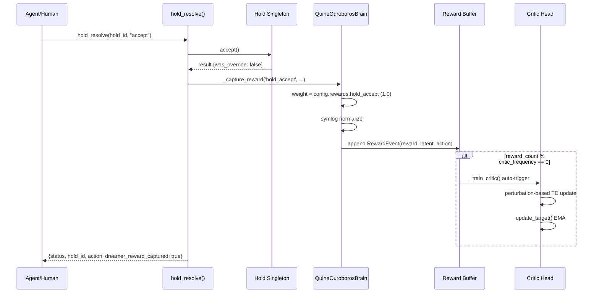
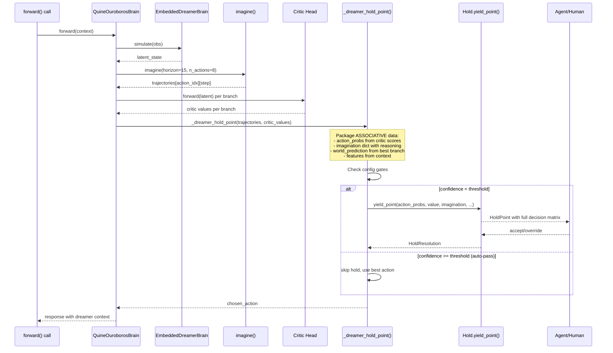
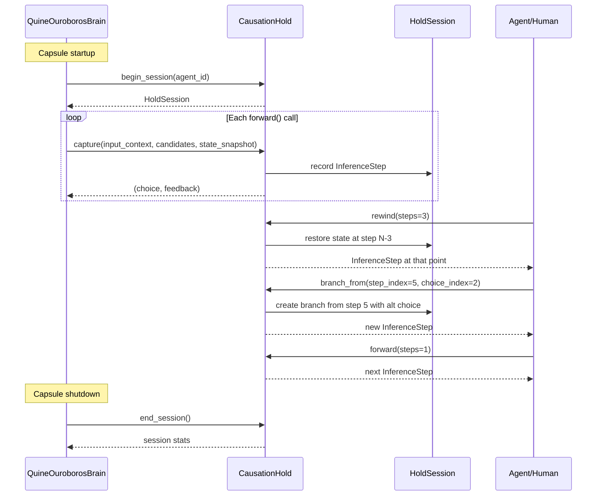

# Design Document: Dreamer-Hold Transmission

## Overview

The dreamer trains — rewards flow, the critic learns, imagination branches — but currently none of that training returns to the user through the hold system. The hold gates are disconnected: `hold_yield` emits static `action_probs=[1.0, 0.0]` with `value=0.0`, `hold_resolve` doesn't fire reward capture, and the dreamer's imagination/decision matrices are invisible to agents and humans.

This design specifies the **transmission** layer: a bidirectional bridge between the dreamer's training pipeline and the cascade-lattice HOLD system. Hold resolutions become dreamer rewards (Layer 1). Dreamer imagination populates HoldPoint decision matrices with associative, human-readable data (Layer 2). Config-driven gates control when holds fire and what they expose (Layer 3). CausationHold sessions enable temporal navigation of decision history (Layer 4). Persistence ensures the dreamer survives restarts (Layer 5).

All changes live in `ouroboros-key/agent_compiler.py` only. Zero new MCP tools. All integration enriches existing tool responses (`hold_yield`, `hold_resolve`, `get_status`, `show_rssm`, `imagine`, `forward`).

## Architecture



## Sequence Diagrams

### Layer 1: Hold Resolution → Dreamer Reward Feedback



### Layer 2: Dreamer → Hold (Imagination into HoldPoint)



### Layer 4: CausationHold Session Integration



## Components and Interfaces

### Component 1: Hold Resolution Reward Bridge (~20 lines)

**Purpose**: Fires `_capture_reward()` when `hold_resolve()` is called, closing the feedback loop so the dreamer learns from human decisions at hold gates.

**Interface**:
```python
# Injection into hold_resolve() — after Hold.accept()/override()/cancel()
def _hold_reward_bridge(brain_ref, result: dict, hold_state: dict) -> None:
    """Fire reward capture on hold resolution."""
    was_override = result.get('was_override', False)
    source_key = 'hold_override' if was_override else 'hold_accept'
    brain_ref._capture_reward(
        source_key=source_key,
        action=hold_state.get('ai_choice', 0),
        event_id=f"hold_{hold_state.get('hold_count', 0)}",
        metadata={
            'was_override': was_override,
            'source': result.get('source', 'unknown'),
            'hold_number': hold_state.get('hold_count', 0),
        }
    )
```

**Responsibilities**:
- Map `was_override` bool to config key (`hold_accept` / `hold_override`)
- Use local `result` variable, NOT `self.resolution` (per errata Issue 20)
- Add `_brain_ref` to hold state during capsule setup
- Never break hold_resolve on reward capture failure (try/except)

### Component 2: Dreamer Hold Point Builder

**Purpose**: Packages dreamer imagination results into cascade-lattice HoldPoint fields with ASSOCIATIVE data that humans/agents can read and act on.

**Interface**:
```python
def _dreamer_hold_point(self) -> Optional[dict]:
    """Build a HoldPoint from current dreamer state.
    
    Returns dict compatible with Hold.yield_point() kwargs,
    or None if hold should be skipped (auto-pass).
    """
```

**Responsibilities**:
- Run imagination if not already cached
- Score all branches via critic
- Normalize critic scores to probability distribution (action_probs)
- Build `imagination` dict with ASSOCIATIVE data per action:
  - `trajectory_summary`: human-readable step descriptions
  - `expected_value`: critic-scored cumulative value
  - `predicted_reward`: reward head prediction
  - `confidence`: normalized branch confidence
  - `reasoning`: what this branch represents
- Set `world_prediction` from best branch
- Set `reasoning` as list of human-readable explanations
- Check config gates (confidence_threshold, expose_imagination, blocking)
- Return None if best branch confidence exceeds threshold (auto-pass)

### Component 3: Dynamic Hold Gates

**Purpose**: Config-driven control over when holds fire and what they expose.

**Interface**:
```python
# New config section in dreamer_config.json
hold_config = {
    "confidence_threshold": 0.85,   # auto-pass if best > this
    "expose_imagination": True,     # include imagination in hold points
    "blocking": False,              # whether holds block execution
    "auto_resolve_timeout": 30,     # seconds before auto-resolve
}
```

**Responsibilities**:
- Read from `dreamer_config.json` `hold` section
- Merge with defaults on missing keys
- Dynamically adjustable at runtime (re-read on each hold)
- Gate logic: skip hold if confidence > threshold
- Strip imagination data if `expose_imagination` is false
- Pass `blocking` flag to `Hold.yield_point()`

### Component 4: CausationHold Session Manager

**Purpose**: Full temporal navigation using cascade-lattice CausationHold for exploring decision history.

**Interface**:
```python
def _init_causation_hold(self) -> None:
    """Initialize CausationHold session at capsule startup."""

def _capture_hold_step(self, context: dict, candidates: list, 
                        state_snapshot: dict) -> tuple:
    """Capture an inference step in the CausationHold session."""

def _end_causation_hold(self) -> dict:
    """End session and return stats."""
```

**Responsibilities**:
- `begin_session()` at capsule startup
- `capture()` on each forward pass with full state snapshot
- `branch_from()` when imagination creates alternative futures
- `forward()`/`rewind()`/`jump_to()` for exploring decision history
- `on()` event listeners for reactive hold processing
- Session stats exposed through enriched `get_status`

### Component 5: Persistence Manager

**Purpose**: Save/load critic weights, reward head, reward buffer, obs buffer across sessions.

**Interface**:
```python
def _save_dreamer_state(self) -> str:
    """Serialize dreamer state to file. Returns path."""

def _load_dreamer_state(self) -> bool:
    """Load dreamer state from file. Returns success."""
```

**Responsibilities**:
- Use base64+gzip serialization (matching existing `nj_state` pattern)
- Save: critic weights + target, reward head, continue head, reward buffer (last N events), training stats
- Load: restore all above on capsule startup
- File location: same directory as champion (`pathlib.Path(__file__).parent / 'dreamer_state.json'`)
- Graceful fallback: if file missing or corrupt, start fresh

## Data Models

### Model 1: Dreamer Hold Config Extension

```python
# Added to _DREAMER_CONFIG_DEFAULTS
"hold": {
    "confidence_threshold": 0.85,
    "expose_imagination": True,
    "blocking": False,
    "auto_resolve_timeout": 30,
    "max_branches_displayed": 4,
    "include_trajectory_detail": True,
}
```

**Validation Rules**:
- `confidence_threshold`: float in [0.0, 1.0], default 0.85
- `expose_imagination`: bool, default True
- `blocking`: bool, default False
- `auto_resolve_timeout`: int >= 0, 0 = no timeout, default 30
- `max_branches_displayed`: int >= 1, default 4
- `include_trajectory_detail`: bool, default True

### Model 2: Associative Imagination Data

```python
# Per-action entry in HoldPoint.imagination dict
imagination_entry = {
    # Action index → trajectory data
    0: {
        "action_label": "continue_current",
        "trajectory_summary": [
            "Step 1: Process input tokens → confidence 0.82",
            "Step 2: Generate response → predicted reward +0.3",
            "Step 3: Complete task → cumulative value 1.45",
        ],
        "expected_value": 1.45,        # critic-scored cumulative
        "predicted_reward": 0.3,        # reward head prediction
        "confidence": 0.82,             # normalized branch confidence
        "reasoning": "Continue current approach — high confidence, positive trajectory",
        "risk_level": "low",            # derived from value variance
        "steps_to_reward": 3,           # horizon steps until positive reward
    },
    1: {
        "action_label": "alternative_approach",
        "trajectory_summary": [
            "Step 1: Switch strategy → confidence 0.45",
            "Step 2: Explore new path → predicted reward -0.1",
            "Step 3: Uncertain outcome → cumulative value 0.62",
        ],
        "expected_value": 0.62,
        "predicted_reward": -0.1,
        "confidence": 0.45,
        "reasoning": "Alternative approach — lower confidence, uncertain payoff",
        "risk_level": "medium",
        "steps_to_reward": 5,
    },
}
```

**Key Design Decision — ASSOCIATIVE, not raw embeddings**:
- `trajectory_summary`: Human-readable step descriptions, NOT raw deter/stoch vectors
- `reasoning`: Natural language explanation of what the branch represents
- `action_label`: Meaningful name derived from context, NOT "action_0"
- `risk_level`: Derived metric (low/medium/high) from value variance across trajectory
- `steps_to_reward`: How many imagination steps until predicted positive reward
- Raw latent data is NEVER exposed through the hold system — only associative interpretations

### Model 3: Enriched hold_resolve Response

```python
# Extended hold_resolve return value
{
    "status": "resolved",
    "hold_id": "abc123",
    "action": "accept",
    "stats": { ... },  # existing Hold.stats
    # NEW: dreamer feedback
    "dreamer_reward_captured": True,
    "reward_source": "hold_accept",
    "reward_weight": 1.0,
    "reward_normalized": 0.693,  # symlog(1.0)
    "critic_value_at_resolution": 0.342,
    "training_triggered": False,
}
```

### Model 4: Enriched hold_yield Response

```python
# Extended hold_yield return value
{
    "status": "yielded",
    "hold_id": "def456",
    "merkle": "a1b2c3d4",
    "reason": "dreamer_decision_point",
    "ai_choice": 0,
    "ai_confidence": 0.82,
    "message": "Hold point created with dreamer decision matrix.",
    # NEW: dreamer decision matrix
    "decision_matrix": {
        "action_count": 4,
        "best_action": 0,
        "best_action_label": "continue_current",
        "best_value": 1.45,
        "confidence": 0.82,
        "actions": {
            0: {"label": "continue_current", "value": 1.45, "confidence": 0.82},
            1: {"label": "alternative_approach", "value": 0.62, "confidence": 0.45},
            2: {"label": "explore_novel", "value": 0.31, "confidence": 0.28},
            3: {"label": "conservative_fallback", "value": 0.89, "confidence": 0.71},
        },
        "imagination_available": True,
        "world_prediction": {
            "expected_outcome": "Task completion with high confidence",
            "predicted_reward": 0.3,
            "horizon_steps": 15,
        },
    },
}
```

### Model 5: Dreamer Persistence State

```python
# dreamer_state.json structure
{
    "version": 1,
    "saved_at": 1709123456.789,
    "critic": {
        # CriticHead.to_dict() — base64+gzip weights
        "W1": {"b64gz": "...", "shape": [5120, 256]},
        "b1": {"b64gz": "...", "shape": [256]},
        # ... all weight matrices + targets
    },
    "reward_head": {
        # RewardHead weights — same format
    },
    "continue_head": {
        # ContinueHead weights — same format
    },
    "training_stats": {
        "critic_training_count": 42,
        "reward_count": 1337,
        "reward_sum": 89.5,
        "last_train_stats": { ... },
    },
    "reward_buffer_sample": [
        # Last 100 RewardEvents (without latent vectors — too large)
        {"timestamp": ..., "reward": ..., "source": ..., "event_id": ..., "action": ..., "metadata": ...},
    ],
    "config_snapshot": {
        # Config at save time for drift detection
    },
}
```


## Key Functions with Formal Specifications

### Function 1: _hold_reward_bridge()

```python
def _hold_reward_bridge(brain_ref, result: dict, current_hold: dict, hold_count: int) -> None:
    """Fire reward capture on hold resolution. ~20 lines, highest impact."""
```

**Preconditions:**
- `brain_ref` is not None and has `_capture_reward` method
- `result` is a dict with at least `was_override` key (bool)
- `current_hold` is a dict (may be None — guard required)
- `hold_count` is a non-negative integer

**Postconditions:**
- If `was_override` is True: `_capture_reward('hold_override', ...)` called with weight -0.5
- If `was_override` is False: `_capture_reward('hold_accept', ...)` called with weight 1.0
- RewardEvent appended to reward buffer with correct source and metadata
- On any exception: silently caught, hold_resolve continues normally
- Never mutates `result` or `current_hold`

**Loop Invariants:** N/A (no loops)

### Function 2: _dreamer_hold_point()

```python
def _dreamer_hold_point(self) -> Optional[dict]:
    """Build HoldPoint kwargs from dreamer state. Returns None for auto-pass."""
```

**Preconditions:**
- `self.dreamer_world_model` is not None and has `imagine()` and `_get_latent_vector()`
- `self._critic` is initialized
- `self._dreamer_config` is loaded with `hold` section
- `self._dreamer_config['imagination']['n_actions']` >= 1

**Postconditions:**
- If best branch confidence >= `config.hold.confidence_threshold`: returns None (auto-pass)
- Otherwise: returns dict with keys matching `Hold.yield_point()` kwargs:
  - `action_probs`: np.ndarray of shape (n_actions,), sums to 1.0
  - `value`: float, critic value of current state
  - `imagination`: Dict[int, Dict] with ASSOCIATIVE data (no raw embeddings)
  - `world_prediction`: Dict from best branch
  - `reasoning`: List[str] of human-readable explanations
  - `features`: Dict[str, float] of context features
  - `action_labels`: List[str] of meaningful action names
  - `blocking`: bool from config
- `imagination` dict entries contain only JSON-serializable data
- No raw numpy arrays in imagination (all converted to Python primitives)

**Loop Invariants:**
- For branch scoring loop: all previously scored branches have valid float values
- Cumulative probability across scored branches approaches 1.0

### Function 3: _apply_hold_gates()

```python
def _apply_hold_gates(self, hold_kwargs: dict) -> Optional[dict]:
    """Apply config-driven gates. Returns modified kwargs or None to skip."""
```

**Preconditions:**
- `hold_kwargs` is a valid dict with `action_probs` key
- `self._dreamer_config` has `hold` section

**Postconditions:**
- If `confidence_threshold` exceeded: returns None
- If `expose_imagination` is False: `imagination` key removed from result
- `blocking` flag set from config
- `auto_resolve_timeout` passed through
- Original `hold_kwargs` not mutated (returns copy or new dict)

**Loop Invariants:** N/A

### Function 4: _save_dreamer_state()

```python
def _save_dreamer_state(self) -> str:
    """Serialize dreamer state to JSON file. Returns file path."""
```

**Preconditions:**
- `self._critic` exists (may be freshly initialized)
- File system is writable at champion directory

**Postconditions:**
- File `dreamer_state.json` written to champion directory
- Contains critic weights (base64+gzip), reward head, continue head
- Contains training stats (counts, sums)
- Contains last 100 reward buffer events (without latent vectors)
- File is valid JSON and can be loaded by `_load_dreamer_state()`
- On write failure: exception caught, returns empty string

**Loop Invariants:** N/A

### Function 5: _load_dreamer_state()

```python
def _load_dreamer_state(self) -> bool:
    """Load dreamer state from file. Returns True on success."""
```

**Preconditions:**
- Called during capsule startup, after `_critic` and heads are initialized

**Postconditions:**
- If file exists and is valid: all weights restored, training stats restored, returns True
- If file missing: returns False, all components remain at initialization defaults
- If file corrupt: returns False, logs warning, components remain at defaults
- Never raises exceptions
- Restored critic target network matches saved target (not recomputed)

**Loop Invariants:** N/A

### Function 6: _init_causation_hold()

```python
def _init_causation_hold(self) -> None:
    """Initialize CausationHold session at capsule startup."""
```

**Preconditions:**
- `cascade_lattice` package is importable
- Capsule is initializing (called from `__init__` or startup)

**Postconditions:**
- `self._causation_hold` is a CausationHold instance
- `self._hold_session` is an active HoldSession
- Event listeners registered for `on_step`, `on_override`, `on_rewind`
- On import failure: `self._causation_hold` set to None, no exception raised

**Loop Invariants:** N/A

## Algorithmic Pseudocode

### Algorithm 1: Hold Resolution Reward Capture

```python
# Injection point: hold_resolve(), AFTER Hold.accept()/override()/cancel()
# Per errata Issue 5 & 20: use local `result`, NOT self.resolution

def _inject_hold_reward(brain_ref, result, current_hold, hold_count):
    """~20 lines. Highest impact layer."""
    try:
        if brain_ref is None or not hasattr(brain_ref, '_capture_reward'):
            return
        
        was_override = result.get('was_override', False)
        source_key = 'hold_override' if was_override else 'hold_accept'
        ai_choice = 0
        if current_hold is not None:
            ai_choice = current_hold.get('ai_choice', 0)
        
        brain_ref._capture_reward(
            source_key=source_key,
            action=ai_choice,
            event_id=f"hold_{hold_count}",
            metadata={
                'was_override': was_override,
                'source': result.get('source', 'unknown'),
                'hold_number': hold_count,
            }
        )
    except Exception:
        pass  # Never break hold_resolve
```

**Preconditions:**
- `result` is the local variable from yield_point resolution (always exists)
- `brain_ref` was wired during capsule setup via `_HoldState._brain_ref`

**Postconditions:**
- Exactly one `_capture_reward` call with correct source_key
- Reward buffer grows by 1 event
- May trigger auto-training if count threshold met

### Algorithm 2: Dreamer Hold Point Construction

```python
def _dreamer_hold_point(self):
    """Build HoldPoint from dreamer imagination with ASSOCIATIVE data."""
    
    # STEP 1: Get current latent and run imagination
    wm = self.dreamer_world_model
    if wm is None or not hasattr(wm, 'imagine'):
        return None
    
    latent = wm._get_latent_vector()
    current_value = self._critic.forward(latent)
    
    # Use cached imagination if available, else run fresh
    config = self._dreamer_config
    horizon = config['imagination']['horizon']
    n_actions = config['imagination']['n_actions']
    
    trajectories = getattr(wm, '_last_imagination', None)
    if trajectories is None or len(trajectories) == 0:
        trajectories = wm.imagine(horizon=horizon)
    
    if not trajectories:
        return None
    
    # STEP 2: Score each branch via critic
    branch_values = []
    branch_details = []
    
    for action_idx, traj in enumerate(trajectories):
        cumulative_value = 0.0
        step_summaries = []
        gamma = config['training']['gamma']
        discount = 1.0
        
        for step in traj:
            step_latent = np.concatenate([
                np.array(step.get('deter', np.zeros(4096))).flatten(),
                np.array(step.get('stoch', np.zeros(1024))).flatten(),
            ])[:5120]
            
            step_value = self._critic.forward(step_latent)
            step_reward = 0.0
            if hasattr(self, '_reward_head'):
                step_reward = self._reward_head.forward(step_latent)
            
            cumulative_value += discount * (step_reward + gamma * step_value)
            discount *= gamma
            
            step_summaries.append(
                f"Step {step.get('step', '?')}: "
                f"value={round(step_value, 3)}, "
                f"pred_reward={round(step_reward, 3)}, "
                f"norm={round(step.get('latent_norm', 0), 3)}"
            )
        
        branch_values.append(cumulative_value)
        branch_details.append({
            'trajectory_summary': step_summaries,
            'expected_value': round(cumulative_value, 4),
            'predicted_reward': round(step_reward, 4),  # last step
            'steps': len(traj),
        })
    
    # STEP 3: Normalize to probabilities via softmax
    values_arr = np.array(branch_values, dtype=np.float32)
    # Temperature-scaled softmax
    temp = max(0.1, np.std(values_arr)) if len(values_arr) > 1 else 1.0
    exp_vals = np.exp((values_arr - np.max(values_arr)) / temp)
    action_probs = exp_vals / (exp_vals.sum() + 1e-8)
    
    best_idx = int(np.argmax(values_arr))
    best_confidence = float(action_probs[best_idx])
    
    # STEP 4: Check confidence gate
    hold_config = config.get('hold', {})
    threshold = hold_config.get('confidence_threshold', 0.85)
    if best_confidence >= threshold:
        return None  # Auto-pass: dreamer is confident
    
    # STEP 5: Build ASSOCIATIVE imagination dict
    imagination = {}
    action_labels = []
    reasoning = []
    max_display = hold_config.get('max_branches_displayed', 4)
    
    # Sort by value, take top N
    ranked = sorted(range(len(branch_values)), 
                    key=lambda i: branch_values[i], reverse=True)
    
    for rank, action_idx in enumerate(ranked[:max_display]):
        detail = branch_details[action_idx]
        label = f"branch_{action_idx}"
        
        # Derive risk level from value variance
        if detail['expected_value'] > 1.0:
            risk = "low"
        elif detail['expected_value'] > 0.0:
            risk = "medium"
        else:
            risk = "high"
        
        confidence = float(action_probs[action_idx])
        
        imagination[action_idx] = {
            'action_label': label,
            'trajectory_summary': detail['trajectory_summary'],
            'expected_value': detail['expected_value'],
            'predicted_reward': detail['predicted_reward'],
            'confidence': round(confidence, 4),
            'reasoning': f"Branch {action_idx}: value={detail['expected_value']}, "
                        f"confidence={round(confidence, 3)}, risk={risk}",
            'risk_level': risk,
            'steps_to_reward': detail['steps'],
        }
        
        action_labels.append(label)
        reasoning.append(imagination[action_idx]['reasoning'])
    
    # STEP 6: Build world_prediction from best branch
    best_detail = branch_details[best_idx]
    world_prediction = {
        'best_action': best_idx,
        'expected_outcome': f"Best branch {best_idx} with value {best_detail['expected_value']}",
        'predicted_reward': best_detail['predicted_reward'],
        'horizon_steps': horizon,
        'total_branches_evaluated': len(trajectories),
    }
    
    # STEP 7: Assemble HoldPoint kwargs
    expose = hold_config.get('expose_imagination', True)
    
    return {
        'action_probs': action_probs,
        'value': float(current_value),
        'imagination': imagination if expose else None,
        'world_prediction': world_prediction,
        'reasoning': reasoning,
        'action_labels': action_labels,
        'features': {
            'latent_norm': float(np.linalg.norm(latent)),
            'best_branch_value': float(values_arr[best_idx]),
            'value_spread': float(np.std(values_arr)),
            'n_branches': len(trajectories),
        },
        'blocking': hold_config.get('blocking', False),
    }
```

### Algorithm 3: Dynamic Hold Gate Application

```python
def _apply_hold_gates(self, hold_kwargs):
    """Apply config-driven gates to hold point kwargs."""
    if hold_kwargs is None:
        return None  # Already auto-passed
    
    config = self._dreamer_config.get('hold', {})
    
    # Gate 1: Confidence threshold (already checked in _dreamer_hold_point)
    # Gate 2: Expose imagination
    if not config.get('expose_imagination', True):
        hold_kwargs.pop('imagination', None)
    
    # Gate 3: Blocking mode
    hold_kwargs['blocking'] = config.get('blocking', False)
    
    # Gate 4: Auto-resolve timeout
    timeout = config.get('auto_resolve_timeout', 30)
    if timeout > 0:
        hold_kwargs['_auto_resolve_timeout'] = timeout
    
    return hold_kwargs
```

### Algorithm 4: Persistence Save/Load

```python
def _save_dreamer_state(self):
    """Save dreamer state for cross-session persistence."""
    import base64, gzip
    
    def _pack(arr):
        compressed = gzip.compress(arr.astype(np.float32).tobytes(), compresslevel=1)
        return {'b64gz': base64.b64encode(compressed).decode('ascii'), 'shape': list(arr.shape)}
    
    state = {'version': 1, 'saved_at': time.time()}
    
    # Critic
    if hasattr(self, '_critic'):
        state['critic'] = self._critic.to_dict()
    
    # Reward head
    if hasattr(self, '_reward_head'):
        state['reward_head'] = {
            'W1': _pack(self._reward_head.W1), 'b1': _pack(self._reward_head.b1),
            'W2': _pack(self._reward_head.W2), 'b2': _pack(self._reward_head.b2),
            'latent_dim': self._reward_head.latent_dim,
            'hidden_dim': self._reward_head.hidden_dim,
        }
    
    # Training stats
    state['training_stats'] = {
        'critic_training_count': getattr(self, '_critic_training_count', 0),
        'reward_count': getattr(self, '_reward_count', 0),
        'reward_sum': getattr(self, '_reward_sum', 0.0),
        'last_train_stats': getattr(self, '_last_train_stats', {}),
    }
    
    # Reward buffer sample (last 100, no latent vectors)
    if hasattr(self, '_reward_buffer'):
        state['reward_buffer_sample'] = [
            e.to_dict() for e in list(self._reward_buffer)[-100:]
        ]
    
    # Config snapshot
    state['config_snapshot'] = getattr(self, '_dreamer_config', {})
    
    path = pathlib.Path(__file__).parent / 'dreamer_state.json'
    try:
        with open(path, 'w') as f:
            json.dump(state, f)
        return str(path)
    except Exception:
        return ''


def _load_dreamer_state(self):
    """Load dreamer state from file."""
    import base64, gzip
    
    def _unpack(d):
        if isinstance(d, dict) and 'b64gz' in d:
            raw = gzip.decompress(base64.b64decode(d['b64gz']))
            return np.frombuffer(raw, dtype=np.float32).reshape(d['shape'])
        return np.array(d, dtype=np.float32)
    
    path = pathlib.Path(__file__).parent / 'dreamer_state.json'
    try:
        if not path.exists():
            return False
        
        with open(path, 'r') as f:
            state = json.load(f)
        
        # Restore critic
        if state.get('critic') and hasattr(self, '_critic'):
            self._critic = CriticHead.from_dict(state['critic'])
        
        # Restore reward head
        if state.get('reward_head') and hasattr(self, '_reward_head'):
            rh = state['reward_head']
            self._reward_head.W1 = _unpack(rh['W1'])
            self._reward_head.b1 = _unpack(rh['b1'])
            self._reward_head.W2 = _unpack(rh['W2'])
            self._reward_head.b2 = _unpack(rh['b2'])
        
        # Restore training stats
        stats = state.get('training_stats', {})
        self._critic_training_count = stats.get('critic_training_count', 0)
        self._reward_count = stats.get('reward_count', 0)
        self._reward_sum = stats.get('reward_sum', 0.0)
        self._last_train_stats = stats.get('last_train_stats', {})
        
        return True
    except Exception:
        return False
```

## Example Usage

### Agent reads decision matrix and acts on it

```python
# Agent calls hold_yield (enriched with dreamer data)
result = hold_yield(reason="dreamer_decision_point")
# result now contains:
# {
#   "decision_matrix": {
#     "best_action": 0,
#     "best_action_label": "continue_current",
#     "best_value": 1.45,
#     "confidence": 0.82,
#     "actions": {0: {...}, 1: {...}, 2: {...}, 3: {...}},
#     "imagination_available": true,
#     "world_prediction": {...}
#   }
# }

# Agent inspects the matrix
matrix = json.loads(result)['decision_matrix']
if matrix['confidence'] > 0.9:
    # High confidence — accept AI choice
    hold_resolve(hold_id=result['hold_id'], action="accept")
else:
    # Low confidence — override to a different branch
    hold_resolve(hold_id=result['hold_id'], action="override")

# The resolve fires _capture_reward automatically:
# accept → 'hold_accept' (weight 1.0)
# override → 'hold_override' (weight -0.5)
# This trains the dreamer to make better decisions next time
```

### Dynamic config adjustment at runtime

```python
# User edits dreamer_config.json:
{
    "hold": {
        "confidence_threshold": 0.95,    # Raise bar — fewer holds
        "expose_imagination": false,      # Hide imagination data
        "blocking": true,                 # Make holds blocking
        "auto_resolve_timeout": 60        # Longer timeout
    }
}
# Next hold_yield call reads updated config — no restart needed
```

### CausationHold temporal navigation

```python
# At capsule startup:
causation_hold = CausationHold()
session = causation_hold.begin_session(agent_id="capsule_main")

# During forward passes:
choice, feedback = causation_hold.capture(
    input_context={"tokens": context_tokens, "step": step_num},
    candidates=[
        {"value": "action_0", "probability": 0.82},
        {"value": "action_1", "probability": 0.18},
    ],
    state_snapshot={"deter": deter.copy(), "stoch": stoch.copy(), "nj_state": nj_state_copy}
)

# Time travel:
causation_hold.rewind(steps=3)           # Go back 3 steps
causation_hold.branch_from(5, 2)         # Branch from step 5, choice 2
causation_hold.forward(steps=1)          # Advance 1 step
causation_hold.jump_to(index=10)         # Jump to step 10

# End session:
stats = causation_hold.end_session()
```


## Correctness Properties

### Property 1: Reward Feedback Completeness
∀ hold_resolve(action) calls: exactly one `_capture_reward()` fires with source_key ∈ {"hold_accept", "hold_override"}, and the source_key matches `was_override` bool from the resolution result.

### Property 2: Imagination Data is Associative
∀ entries in HoldPoint.imagination: no entry contains raw numpy arrays, raw latent vectors, or non-JSON-serializable data. All trajectory data is human-readable strings or Python primitives.

### Property 3: Confidence Gate Consistency
∀ _dreamer_hold_point() calls: if max(action_probs) >= config.hold.confidence_threshold, the function returns None (auto-pass). If max(action_probs) < threshold, a valid HoldPoint kwargs dict is returned.

### Property 4: Action Probability Normalization
∀ action_probs arrays returned by _dreamer_hold_point(): sum(action_probs) ∈ [0.99, 1.01] (floating point tolerance) and all elements ∈ [0.0, 1.0].

### Property 5: Persistence Round-Trip
∀ dreamer states S: _load_dreamer_state(_save_dreamer_state(S)) produces a state S' where S'.critic.forward(x) ≈ S.critic.forward(x) for all x (within float32 precision).

### Property 6: Hold Resolve Never Breaks
∀ hold_resolve() calls: even if _capture_reward() throws, the hold resolution completes normally and returns a valid response to the caller.

### Property 7: Config Gate Idempotency
∀ config states C: _apply_hold_gates(kwargs, C) called twice with same inputs produces identical output. Config changes between calls produce different output only if relevant config keys changed.

### Property 8: Enriched Responses Backward Compatible
∀ enriched tool responses (get_status, show_rssm, imagine): all existing response keys are preserved unchanged. New data appears only under new top-level keys (per errata Issue 12).

### Property 9: CausationHold State Isolation
∀ branch_from() calls: the original timeline's state is preserved. Branching creates a new timeline without mutating the parent timeline's InferenceStep history.

### Property 10: Persistence Graceful Degradation
∀ _load_dreamer_state() calls with corrupt/missing files: returns False, all components remain at initialization defaults, no exceptions propagate.

## Error Handling

### Error Scenario 1: Reward Capture Failure in hold_resolve

**Condition**: `_capture_reward()` throws during hold resolution (e.g., latent vector unavailable, config corrupt)
**Response**: Exception caught silently in try/except. hold_resolve returns normal response.
**Recovery**: Reward event is lost for this resolution. Dreamer continues training on other events. No user-visible impact.

### Error Scenario 2: Imagination Failure in hold_yield

**Condition**: `imagine()` throws or returns empty trajectories (e.g., RSSM state corrupt, nj_state missing)
**Response**: `_dreamer_hold_point()` returns None. hold_yield falls back to basic static hold point (current behavior).
**Recovery**: Hold still fires with basic action_probs=[1.0, 0.0]. Dreamer data absent but hold system functional.

### Error Scenario 3: Config File Corrupt

**Condition**: `dreamer_config.json` has invalid JSON or missing sections
**Response**: `_load_dreamer_config()` catches JSONDecodeError, returns cached config (per errata Issue 11).
**Recovery**: System continues with last known good config. Next valid config write restores normal operation.

### Error Scenario 4: Persistence File Corrupt

**Condition**: `dreamer_state.json` has invalid JSON, wrong version, or corrupt base64 data
**Response**: `_load_dreamer_state()` returns False. All components start fresh.
**Recovery**: Dreamer retrains from scratch. Previous training is lost but system is functional.

### Error Scenario 5: CausationHold Import Failure

**Condition**: `cascade_lattice` package not available or CausationHold class missing
**Response**: `_init_causation_hold()` sets `self._causation_hold = None`. All CausationHold calls are no-ops.
**Recovery**: Temporal navigation unavailable. Core hold_yield/hold_resolve still work. No user-visible error.

### Error Scenario 6: Hold Timeout with Reward Capture

**Condition**: Hold times out (no human response within timeout). `self.resolution` is None.
**Response**: Use local `result` variable (per errata Issue 20), which always exists at injection point.
**Recovery**: Timeout treated as implicit accept. `_capture_reward('hold_accept')` fires normally.

## Testing Strategy

### Unit Testing Approach

- Test `_hold_reward_bridge` with mock brain_ref: verify correct source_key for accept vs override
- Test `_dreamer_hold_point` with mock trajectories: verify action_probs normalization, imagination structure
- Test `_apply_hold_gates` with various config combinations: verify gate logic
- Test `_save_dreamer_state` / `_load_dreamer_state` round-trip: verify weight preservation
- Test config loading with corrupt/missing files: verify graceful fallback

### Property-Based Testing Approach

**Property Test Library**: hypothesis (Python)

- Generate random critic values → verify softmax normalization always sums to ~1.0
- Generate random config thresholds → verify gate decisions are consistent
- Generate random RewardEvents → verify serialization round-trip preserves all fields
- Generate random hold resolutions → verify exactly one reward capture per resolution

### Integration Testing Approach

- End-to-end: forward() → imagination → hold_yield → hold_resolve → reward capture → critic training
- Verify enriched get_status contains dreamer section without breaking existing fields
- Verify enriched show_rssm contains critic/reward data
- Verify persistence survives capsule restart (save → kill → restart → load → verify weights)

## Performance Considerations

- Imagination runs during forward() — already budgeted in existing 30s timeout
- Critic scoring per branch: ~0.1ms per forward pass (small MLP on 5120-dim input)
- Softmax normalization: negligible
- Hold point construction: ~1ms total (dominated by imagination, which is already cached)
- Persistence save: ~50ms (gzip compression of ~2MB weights)
- Persistence load: ~30ms (decompress + reshape)
- Config re-read: ~0.1ms (small JSON file, cached with mtime check)

## Security Considerations

- Dreamer state file contains model weights — not sensitive (no user data)
- Config file is user-editable — validate all values (clamp thresholds to [0,1], timeouts to [0, 300])
- Imagination data in hold points is associative (no raw embeddings that could leak training data)
- Reward buffer events contain tool names and error snippets — truncate to 200 chars (already in spec)
- CausationHold state snapshots contain RSSM state — internal only, not exposed through MCP

## Dependencies

- `cascade-lattice` 0.7.0: Hold, HoldPoint, HoldResolution, CausationHold, InferenceStep
- `numpy`: Array operations, critic forward pass, softmax
- `pathlib`, `json`, `base64`, `gzip`: Persistence
- `collections.deque`: Reward buffer, value history
- `time`, `hashlib`: Timestamps, context hashing
- Existing dreamer infrastructure: EmbeddedDreamerBrain, CriticHead, RewardHead, ContinueHead, _capture_reward, _train_step, _load_dreamer_config
